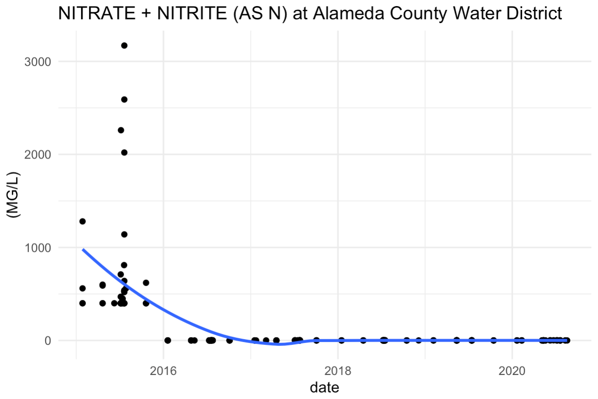

# sdwisard 🧙💧🧪

Query tool for SDWIS (Safe Drinking Water Information System)

## Purpose

In California, present sources of water quality information are fragmented across thousands of water utilities and lack consistency and clarity. Moreover, although the state has identified [open and transparent water data](https://water.ca.gov/ab1755) as critical to inform water management and achieve goals set in [Human Right to Water](https://oehha.ca.gov/water/report/human-right-water-california), analysts remain hampered by a paucity of easy-to-use, open-source tools to acquire and analyze water quality data. 

The `sdwisard` package is an easy-to-use, open-source query tool for California drinking water quality data in the [SDWIS database](https://sdwis.waterboards.ca.gov/PDWW/JSP/MonitoringResults.jsp?tinwsys_is_number=4740&tinwsys_st_code=CA&counter=0). It was developed as an entry to the [CA Water Data Challenge 2020](https://waterchallenge.data.ca.gov) to demonstrate the utility of easy-to-use API wrappers that empower analysts to get more done with data with less effort. Currently the SDWIS database is inconvenient to query and lacks a public facing API. This wrapper grabs data hosted in an AWS s3 bucket so we can pretend there is already the infrastructure to support this type of development. 

## Installation

This package is not yet on CRAN. Download it from Github as follows:  

```r
remotes::install_github(repo = "CAopenwater/sdwisard")
```

## Basic Usage

The heart of this package is the `get_data()` function. To obtain data, simply supply a PSID (public water system ID number).  

```r
sdwisard::get_data(psid) 
```

## Quickstart

Supply a PSID and storet number to get data. Here, we get nitrate data in Alameda County Water District.  

```r
alameda_nitrate <- get_data(psid = "0110001", storet = "A-029")

alameda_nitrate %>% 
  mutate(date = as.Date(SAMP_DATE)) %>% 
  ggplot(aes(date, FINDING)) +
  geom_point() +
  geom_smooth(se = FALSE) +
  labs(title = "NITRATE + NITRITE (AS N) at Alameda County Water District",
       y = "(MG/L)") +
  theme_minimal()
```



For more details see our [Getting Started](https://CAopenwater.github.io/sdwisard/articles/getting-started.html) article.
